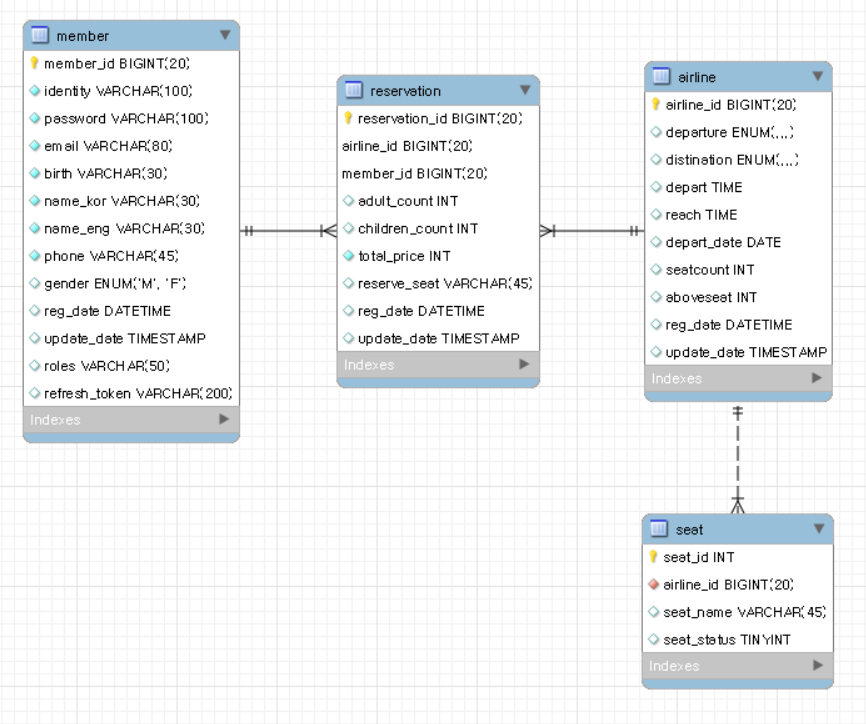

# SpringBoot-JPA-mysql-MinAir
 > 여행가고싶다는 단순한 생각중 항공편 가격들이 궁금해져 둘러보다 항공권 검색 시스템에 대한 구현을 해보고 싶어져 진행.
  * 웹보단 API 구성에 집중
  * http://18.188.247.147/docs/index.html API rest-docs 주소
  * AWS EC2와 AWS RDS MariaDB를 통해 18.188.247.147 배포
 
 ## 목적
 * 객체지향적 코드를 작성하기 위해 ORM을 사용하며 객체지향적 코드의 이해도 증진과 학습에 중점을 두고 서비스 구현
 * spring의 여러 파일 설정들과 영속성 프레임워크 연동등의 복잡한 초기구성에서 벗어나 SpringBoot를 사용해보고 ORM 그리고 Rest Api에 대한 이해도 증진과 구현.
 * 단순 게시판 구현에서 벗어나 새로운 서비스 구현.
 * Junit4,5 테스트를 통해 4와 5의 차이와 테스트를 구성하여 로직을 구현하는것에 대한 장점을 체감
 * 실제로 리눅스 노트북이나 AWS 통한 배포방법 체감.
 ## 개발환경
 > Front-End
  * Bootstrap 3
  * Jquery 2.2.1
  * Thymleaf
 > Back-End
  * SpringBoot 2.4.5
    * 기존 Spring의 복잡한 설정을 간편화
  * JDK 11
  * MariaDB 10.4
  * H2 Database 1.4.200
    * 테스트시 사용할 DB
  * JPA 2.4.4
  * Maven
  * QueryDsl 4.3.1
  * Spring Rest docs
    * Rest Api 문서화를 위해 사용. 
    * MockMvc로 테스트된 내용들을 토대로 문서html 구현 
  * Spring Security & JWT Token
    * Spring Security의 세션방식의 로드벨런싱 문제를 해결하기 위해 JWT Token을 활용해 회원, 로그인상태 검증
## 제작기간 - 2021-04-05 ~ ing
 > 1주차 : 사용할 기술 스택 선정과 ERD설계, 일정 구상. 웹과 API기능을 나눠서 개발하는것으로 결정.
 
 > 2주차 ~ 5주차 : 엔티티, Respository,Service,Controller,Test 구현. 
   * => 테스트를 구성하는 방법이 허술하고 어느정도의 범위까지 테스트해야하는지 기준을 잡지 못했다.
   * => 로직 구현 역시 Client와 Controller사이의 요청과 응답시 DTO를 주고 받지만 Controller와 Service사이엔 DTO를 받아야 하는지 Controller에서 
        엔티티로 변환해서 쭉 DB까지 내려줄지 정확한 판단 x.
   * => 초기 설계가 굉장히 중요하다는걸 다시금 꺠달음.
  
 > 6주차~7주차 : Api를 시작전 Rest Docs 와 Hateos 즉 Rest Api level 3에 대한 학습의 필요성을 느껴 공부.
 
 > 8주차 ~ 10주차 : Rest 방식으로 Api구성후 테스트.
 
 > 10주차 ~ 현재 : 예외처리에 대한 고민과 단일 테스트 부족, 리펙토링 요소들이 많이 보여 테스트와 리펙토링, 추가적인 기능들 추가중.

 * 21.06.27 V1 배포 진행. 이후 git flow 방식에 맞게 v2구현 예정.
 
 * v2엔 항공권 수정,삭제, 회원 탈퇴, 각 목록들에 검색기능,허술한 프론트부분 수정및 구현 예정.
 * 부적절한 어노테이션 개선
## DataBase ERD

## 현재까지 고민
 * Api는 응답Status를 통해 해당 예외에 대한 큰 설명이 가능. 웹파트는 AdviceController를 통해 해당 어플리케이션에서 발생하는 예외를 한번에 잡아서 예외별로 처리해주었다. 리펙토링. 피곤한경우 생각없이 구성한 코드가 몇몇 군데 보임.. 반성..  

 * 초기의 설계가 안정적이냐 안정적이지 못하냐가 해당 프로젝트의 안정성과 견고함을 판가름 한다는 생각이 강해졌다
 * Hateoas의 필요성에 대해 의문이듬. 물론 좋은 방법이지만 생산성 측면에서 효율적일지 의문..
 * 예외처리에 대한 고민. 간단하게 메세지와 어디에서 발생했는지 정도의 정보만 출력해주면 되는지...
 * 테스트는 세세하게 하면 할 수록 코드의 안정성을 높히고 이식성또한 높인다고 생각됨. 세세하게 테스트 진행할것.
 * 현재 개인 우분트 노트북에 올려놓고 ssh를 통해 포트포워딩해 배포하였다. AWS를 활용할지 해당 노트북으로 할지 고민중. -> AWS로 바꾸는 걸로 기울었다.
 * 도커와 젠킨스에 대해 궁금해져 공부후 적용해볼 예정이다.
